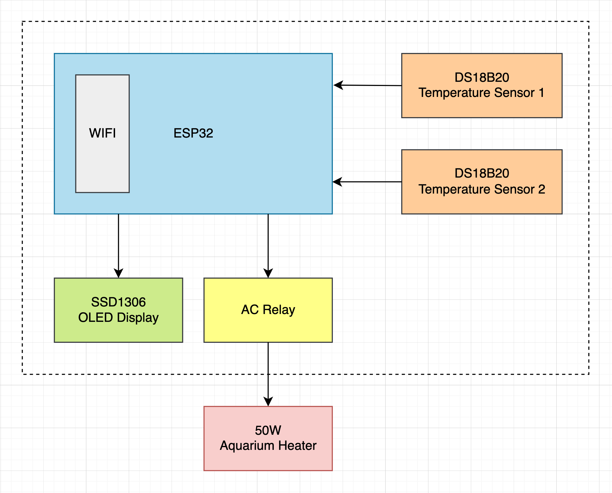
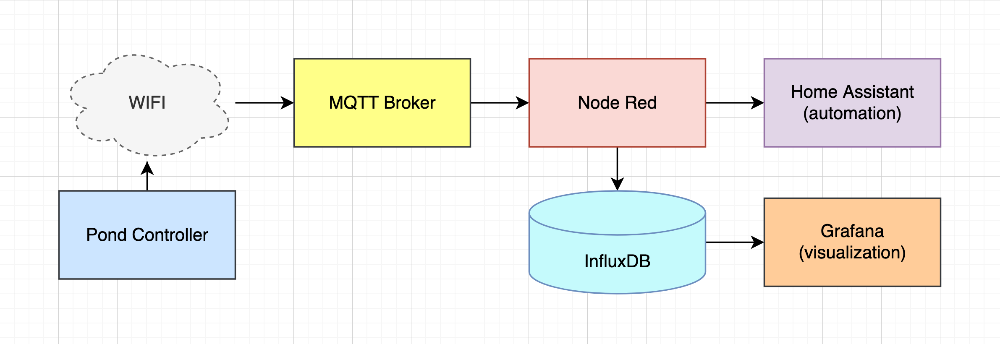
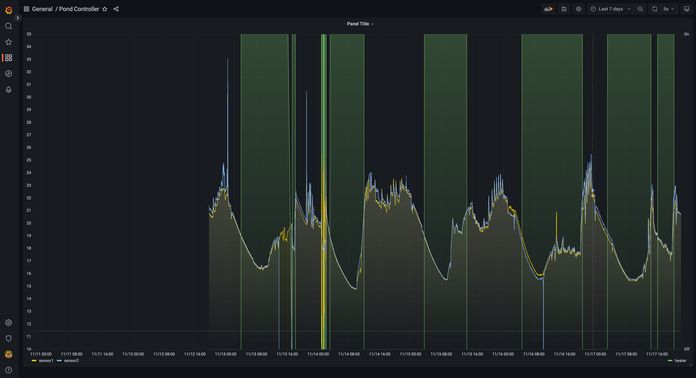

# Pondcontroller

Temperature controller and logger for aquarium/ponds/sous vide.

An ESP32 microcontorller senses both water temperature (used to control the heater output), as well as ambient air temperature (for informational purposes only), whilst simultaneously maintaining a WIFI connection over which it periodically publishes data to a remote broker via MQTT for logging and automation (see Supporting Software).

The microcontroller stores configuration settings (including temperature set-point, temperature deviance, status publish interval, and heater control interval) in ROM, and allows these settings to be updated over the network whilst the device is running.

Temperature control is maintained using simple hysteresis.  With a desired temperature specified (the "set-point"), along with a "deviance" amount that defines the temperature above and below the set-point beyond which the heater will turn off and on.


# Hardware

Main components include an ESP32-S3 microcontroller, 2 1-wire DS18B20 weatherproof temperature sensors, a suitable mains rated AC relay module, an SSD1306 128x64 monochrome OLED display, and a momentary switch.




# Supporting Software

The device periodically publishes data via the WIFI connection to an MQTT broker.  This allows for things like storing and visualization, or home automation.  A typical software stack might look like the following:



Messages arrive at the MQTT Broker.  NodeRed can be used to process incoming data and stream it out to a datastore (like Influx DB, a time-series oriented database), or make it available to Home Assistant for automating something.  Grafana can handle visualizing the data, once stored in the database.




## Initial Configuration

Prior to first use, various settings need to be configured and written to the microcontroller's ROM, including your WIFI credentials, the address of the MQTT broker, set-point temperature, etc. Refer to the companion project [github.com/mlilley/pondcontroller_esp32_prefs](https://github.com/mlilley/pondcontroller_esp32_prefs).

Additioanlly some configuration settings can be changed whilst the device is running, by sending the device commands via MQTT (see "Commands" section below for further details).


## MQTT Data Logging

The device periodically publishes the current temperature readings from both sensors, as well as the state of the heater via the WIFI connection to an MQTT broker on the network, to the following topics:

```
Topic:   <namespace>/sensor/<deviceid>/sensor1
Payload: Current temperature in degrees centigrade from sensor 1 as a string serialized float.
Example: "23.123"
```

```
Topic:   <namespace>/sensor/<deviceid>/sensor2
Payload: Current temperature in degrees centigrade from sensor 2 as a string serialized float.
Example: "35.004"
```

```
Topic:   <namespace>/sensor/<deviceid>/heater
Payload: Current state of heater.
Example: "1" (on) or "0" (off)
```

Additionally, the combined state is sent in Json format as follows:

```
Topic:   <namespace>/sensor/<deviceid>/data
Payload: Sensor 1, Sensor 2 and heater state as Json
Example: "{\"sensor1\":23.123,\"sensor2\":35.004,\"heater\":1}"
```

## MQTT Commands 

The device also listens for commands sent via MQTT to do things like update configuration, or request current settings.  The device listens for these commands on the MQTT topic `<namespace>/sensor/<deviceid>/cmd`, and responses are sent back on topic `<namespace>/sensor/<deviceid>/response`.

Commands are of the form `"<requestId>:<command>[:<argument>]"`, where:
* `<requestId>` is a value (max 9 chars) included in the response to allow correlation to the request.
* `<command>` is the desired command.
* `<argument>` is an optional argument, as required by the specific command.

Configuration changed by command is written to ROM and thus permanently retained.

```
Command: Update the set-point temperature
 Format: "<requestid>:SET_SETPOINT:<value>"
  Where: <value> is the desired new set-point temperature in degrees centigrade between 10.0 and 30.0.
     Ex: "1:SET_SETPOINT:25.000"
```

```
Command: Update the deviance amount
 Format: "<requestid>:SET_DEVIANCE:<value>"
  Where: <value> is the desired new deviance amount in degrees centigrade between 0.25 and 5.0.
     Ex: "1:SET_DEVIANCE:1.0"
```

```
Command: Update the heater control interval
 Format: "<requestid>:SET_CONTROL_INTERVAL:<value>"
  Where: <value> is the desired new control interval in milliseconds between 100 (0.1 seconds) 
         and 3600000 (1 hour).
     Ex: "1:SET_CONTROL_INTERVAL:1000"
```

```
Command: Update the mqtt publish interval
 Format: "<requestid>:SET_PUBLISH_INTERVAL:<value>"
  Where: <value> is the desired new publish interval in milliseconds between 1000 (1 second) 
         and 3600000 (1 hour).
     Ex: "1:SET_CONTROL_INTERVAL:30000"
```   


